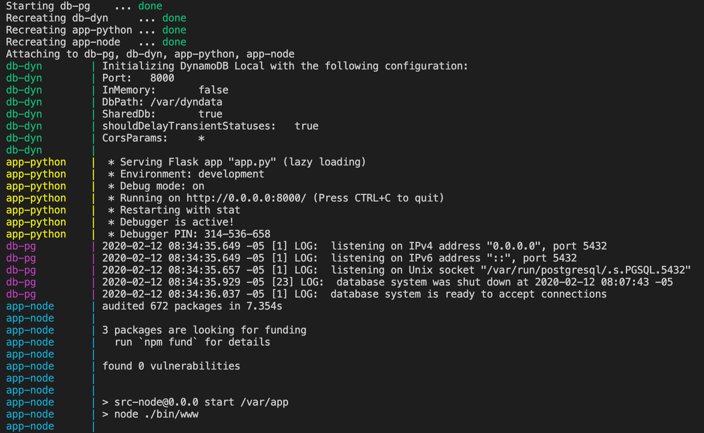

# docker-compose-demo
Ejemplo simple de aplicaciones agrupadas sobre entorno Docker Compose, usando submodulos GIT



## Para agregar submodulos

- Agregar Submodulo Node
```
git submodule add https://github.com/codigonet/docker-node-demo src-node
```

- Agregar Submodulo Python/Flask
```
git submodule add https://github.com/codigonet/docker-python-demo src-flask
```

- Agregar Submodulo DynamoDB
```
git submodule add https://github.com/codigonet/docker-dynamodb-demo src-dynamo
```

## Para actualizar submodulos existentes

- Inicializar y actualizar Submodulos
```
git submodule update --init --recursive
```

- Actualizar Submodulo Node
```
cd src-node
git pull
```

- Actualizar Submodulo Python/Flask
```
cd src-flask
git pull
```
